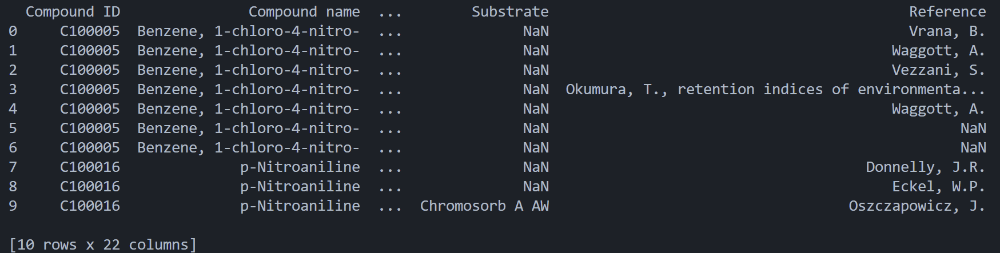
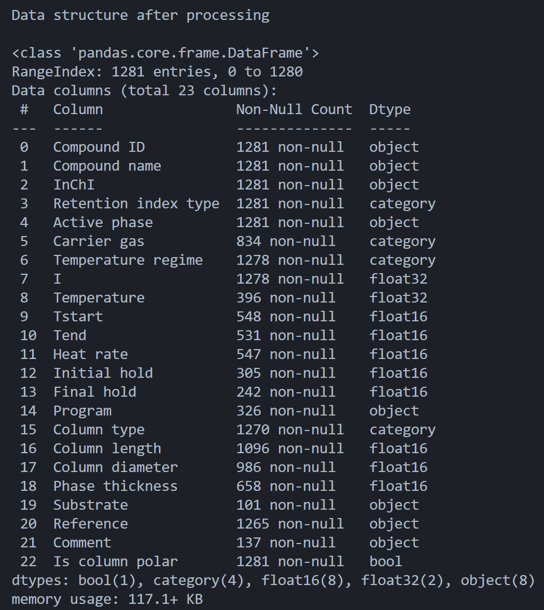

# DDE-repo
Created for ITMO's Data Driven Engineering homework

Dataset contains information about **gas chromatography (GC)**

[Link](https://drive.google.com/file/d/1twkoRrET6qJqgXPzG9jzrMqQikSzi1Ok/view?usp=sharing) to dataset

### How to start the code
1. Download conda
2. Write this comand in terminal: ```conda env create -f environment.yml```
3. Create `data` folder in the project directory
4. Move .csv file into `data` folder

### Result of data_loader.py
READ_DATASET(data_path)
Reads dataset (CSV format) and converts it into pandas.DataFrame.
read_dataset() return:


---

DATA_PROCESSING(data)
Processes data changing columns type and do some data optimization.
data_processing() return:


---

SAVE_DATA(data)
Saves data into `.parquet` file. File will save in `data/` directory 

---

Render EDA.ipynb [link](https://nbviewer.org/github/Eternal-insomnia/DDE-repo/blob/main/notebooks/EDA.ipynb)
